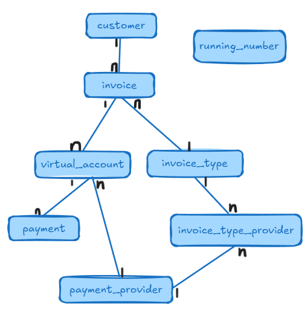

# Invoice Management

Aplikasi ini dipakai untuk mengelola invoice dan menyambungkan dengan berbagai metode. Diantara metode pembayaran yang akan di support antara lain adalah:

* Virtual Account Bank
    * Bank BNI
    * Bank CIMB
    * Bank BSI
* e-Wallet
    * Ovo
    * Gopay
* QR Payment
    * QRIS

Tipe tagihan yang tersedia:

  * CLOSED : bayar sesuai nominal, jika tidak sesuai, ditolak
  * OPEN : pembayaran berapapun diterima
  * INSTALLMENT : pembayaran diterima selama total akumulasi lebih kecil atau sama dengan nilai tagihan

## Tech Stack
Daftar framework & library apa saja yang digunakan:
* Java (programming language)
* Postgresql (relational database)
* Spring Data JPA (object relational mapping)
* Thymeleaf (modern server side java template engine)
* Spring Web (java web framework)
* Flyway Migration (database migration)
* Postgresql Driver (java program to connect to a postgresql database)
* Lombok (java annotation library for reduce boilerplate code)
* Spring Validation

## Schema Database Relational

